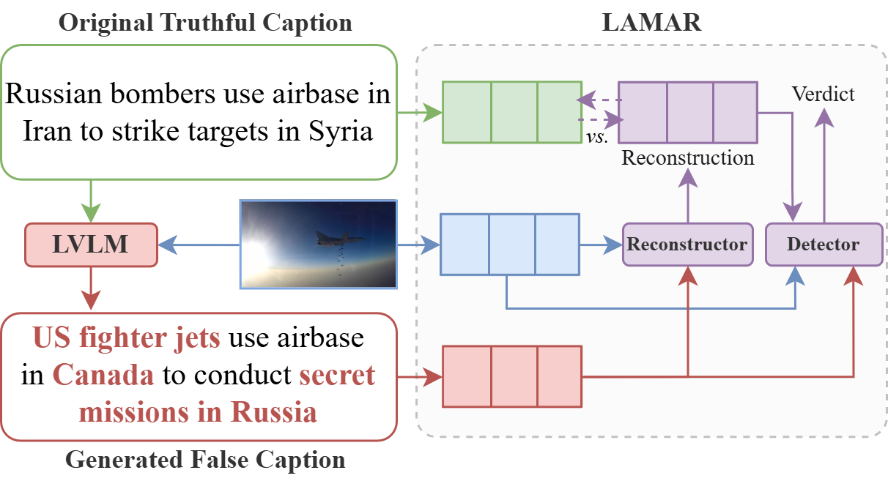

# Latent Multimodal Reconstruction for Misinformation Detection

Repository for the paper "Latent Multimodal Reconstruction for Misinformation Detection". 

## Abstract
>*Multimodal misinformation, such as miscaptioned images, where captions misrepresent an image’s origin, context, or meaning, poses a growing challenge in the digital age. To support fact-checkers, researchers have been focusing on creating datasets and developing methods for multimodal misinformation detection (MMD). Due to the scarcity of large-scale annotated MMD datasets, recent studies leverage synthetic training data via out-of-context image-caption pairs or named entity manipulations; altering names, dates, and locations. However, these approaches often produce simplistic misinformation that fails to reflect real-world complexity, limiting the robustness of detection models trained on them. Meanwhile, despite recent advancements, Large Vision-Language Models (LVLMs) remain underutilized for generating diverse, realistic synthetic training data for MMD. To address this gap, we introduce "MisCaption This!", a training dataset comprising LVLM-generated miscaptioned images. Additionally, we introduce “Latent Multimodal Reconstruction” (LAMAR), a network trained to reconstruct the embeddings of truthful captions, providing a strong auxiliary signal to the detection process. To optimize LAMAR, we explore different training strategies (end-to-end training and large-scale pre-training) and integration approaches (direct, mask, gate, and attention). Extensive experiments show that models trained on "MisCaption This!" generalize better on real-world misinformation, while LAMAR sets new state-of-the-art on both NewsCLIPpings and VERITE benchmarks; highlighting the potential of LVLM-generated data and reconstruction-based approaches for advancing MMD.*



## Preparation
- Clone this repo: 
```
git clone https://github.com/stevejpapad/miscaptioned-image-reconstruction/
cd miscaptioned-image-reconstruction/
```
- Create a python (>= 3.9) environment (Anaconda is recommended) 
- Install all dependencies with: `pip install -r requirements.txt`.

## Datasets
Access to the "Miscaption This!" dataset is available upon request and is intended solely for research purposes.
If you want to reproduce the experiments of the paper, it is necessary to first download the following datasets and save them in their respective folder: 
- VisualNews -> https://github.com/FuxiaoLiu/VisualNews-Repository -> `VisualNews/`
- NewsCLIPings -> https://github.com/g-luo/news_clippings -> `news_clippings/`
- VERITE -> https://github.com/stevejpapad/image-text-verification -> `VERITE/`

If you encounter any problems while downloading and preparing VERITE (e.g., broken image URLs), please contact stefpapad@iti.gr

## Reproducibility
To extract CLIP features and reproduce all experiments run: 
```python src/main.py``` 

## Acknowledgements
This work is partially funded by the "vera.ai: VERification Assisted by Artificial Intelligence" under grant agreement no. 101070093 and "DisAI - Improving scientific excellence and creativity in combating disinformation with artificial intelligence and language technologies" under grant agreement no. 101079164. 

## Licence
This project is licensed under the Apache License 2.0 - see the [LICENSE](https://github.com/stevejpapad/miscaptioned-image-reconstruction/blob/main/LICENSE) file for more details.

## Contact
Stefanos-Iordanis Papadopoulos (stefpapad@iti.gr)

